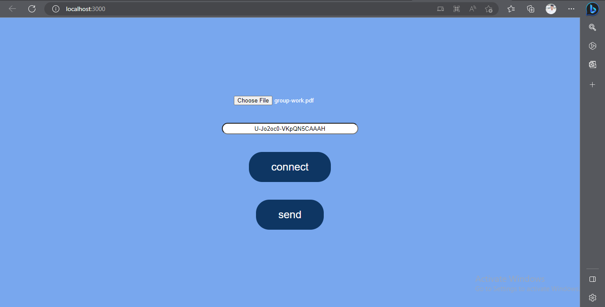
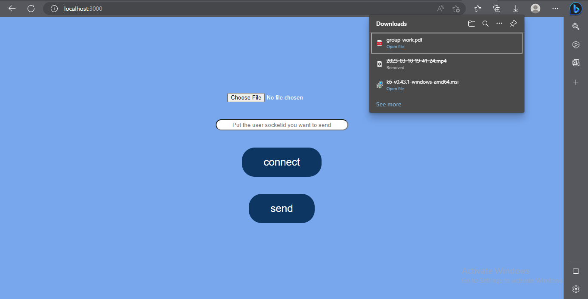
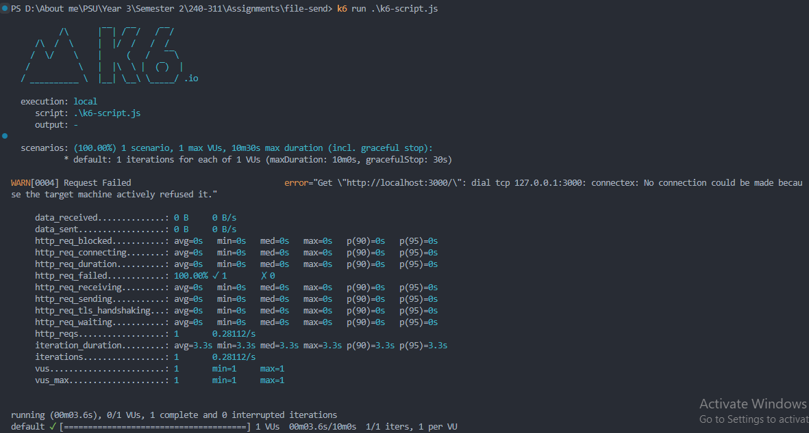
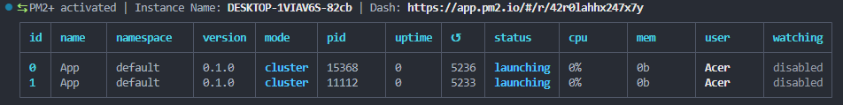

# Real Time File Transfer

"Real Time File Transfer" เป็นแอปพลิเคชันแชร์ไฟล์อย่างง่ายที่สร้างโดยใช้ Node.js และ Express.js

ต่อไปจะเป็นภาพรวมทั่วไปเกี่ยวกับวิธีการใช้ K6 และ PM2 ในโครงการประเภทนี้

## การทำงานโดยทั่วไปของ Real Time File Transfer:

1. การอัปโหลดไฟล์: อนุญาตให้ผู้ใช้อัปโหลดไฟล์ไปยังเซิร์ฟเวอร์

2. การดาวน์โหลดไฟล์: อนุญาตให้ผู้ใช้ดาวน์โหลดไฟล์จากเซิร์ฟเวอร์

3. การจัดการไฟล์: อนุญาตให้ผู้ใช้จัดการไฟล์ เช่น การลบหรือเปลี่ยนชื่อไฟล์

ในการทำงานเหล่านี้ แอปพลิเคชันน่าจะมีคอมโพเนนต์ฝั่งเซิร์ฟเวอร์ (ใช้งานโดยใช้ Node.js และ Express.js) และคอมโพเนนต์ฝั่งไคลเอ็นต์ (ใช้งานโดยใช้ HTML, CSS และ JavaScript)

## K6:

K6 เป็นเครื่องมือทดสอบประสิทธิภาพที่สามารถใช้เพื่อจำลองการรับส่งข้อมูลของผู้ใช้และทดสอบประสิทธิภาพของแอปพลิเคชันภายใต้เงื่อนไขต่างๆ ต่อไปนี้คือบางวิธีที่อาจใช้ K6 ในโครงการนี้:

1. Load Testing: ใช้ K6 เพื่อจำลองการอัปโหลดและดาวน์โหลดไฟล์ของผู้ใช้พร้อมกันจำนวนมากเพื่อทดสอบประสิทธิภาพและความสามารถในการปรับขนาดของแอปพลิเคชัน
2. Stress Testing: ใช้ K6 เพื่อจำลองการโหลดสูงบนเซิร์ฟเวอร์เพื่อระบุคอขวดที่อาจเกิดขึ้นหรือปัญหาเกี่ยวกับประสิทธิภาพของแอปพลิเคชัน
3. Performance Monitoring: ใช้ K6 เพื่อตรวจสอบประสิทธิภาพของแอปพลิเคชันอย่างต่อเนื่อง และแจ้งเตือนทีมพัฒนาหากประสิทธิภาพลดลงต่ำกว่าเกณฑ์ที่กำหนด

## PM2 Implementation:

PM2 เป็นตัวจัดการกระบวนการสำหรับแอปพลิเคชัน Node.js ที่สามารถใช้เพื่อให้แน่ใจว่าแอปพลิเคชันทำงานตลอดเวลา และจัดการบันทึกของแอปพลิเคชันและตัวแปรสภาพแวดล้อม ต่อไปนี้คือบางวิธีที่อาจใช้ PM2 ในโปรเจ็กต์นี้:

1. Process Management: ใช้ PM2 เพื่อเริ่มต้นและจัดการกระบวนการเซิร์ฟเวอร์ Node.js เพื่อให้แน่ใจว่ากระบวนการทำงานอยู่เสมอและเริ่มกระบวนการใหม่หากเกิดข้อผิดพลาด
2. Log Management: ใช้ PM2 เพื่อจัดการบันทึกของแอปพลิเคชัน รวมถึงการหมุนเวียนบันทึกและการสตรีมบันทึกไปยังบริการบันทึกระยะไกล
3. Environment Variable Management: ใช้ PM2 เพื่อจัดการตัวแปรสภาพแวดล้อมของแอปพลิเคชัน เช่น ข้อมูลประจำตัวของฐานข้อมูลหรือคีย์ API

## สรุป

โดยรวมแล้ว โปรเจกต์นี้เป็นแอปพลิเคชันแชร์ไฟล์แบบ Real Time ที่เรียบง่ายแต่มีประโยชน์ ซึ่งสามารถนำไปใช้งานบนเซิร์ฟเวอร์และใช้เพื่อแชร์ไฟล์กับผู้อื่นได้ หากผิดพลาดประการใด ทางคณะผู้จัดทำก็ขออภัยมา ณ ที่นี้ด้วย

[Video Demo](https://youtu.be/3Vzy2fF8zec) แสดงการทำงาน ซึ่งสามารถรันได้จาก localhost เลย

### สมาชิกในกลุ่ม

1. นายพีรพล ศิริวิริยาภรณ์ 6310110334
2. นายสุกัลย์ กูณาพืช    6310110518
